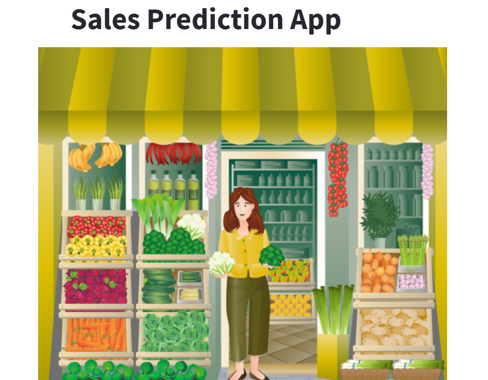
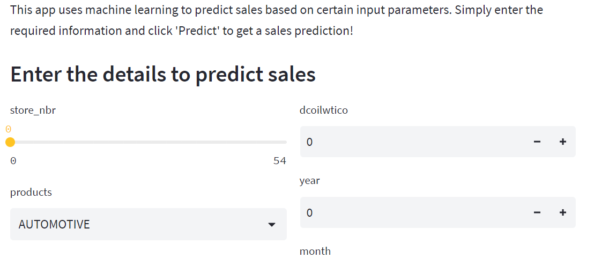
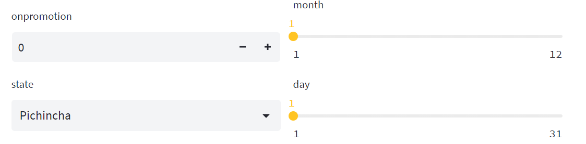
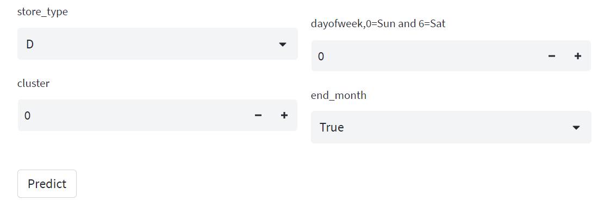

# Streamlit-grocery-sales-prediction-app
Streamlit-grocery-sales-prediction-app is a web application designed to predict the sales of a grocery shop based on various input features. This application is built using the Streamlit framework, which allows for easy and interactive data analysis and visualization. The app is designed to take inputs such as store number, products, on promotion, state, store type, cluster, date, and other variables to provide a predicted sales value. This app is useful for grocery store owners who want to predict their sales for a given period and make better business decisions based on the predicted values.

## Summary
| Code      | Name        | Published Article |  Deployed App |
|-----------|-------------|:-------------:|------:|
| LP4 | Churn Prediction with Gradio |  [https://medium.com/@alidu143/building-a-sales-prediction-app-with-streamlit-and-machine-learning-31746625d6ca](/) | [https://huggingface.co/spaces/Abubakari/Sales_Prediction#sales-prediction-app](/) |

## Project Description
The Streamlit Grocery Sales Prediction App is a web application that allows users to predict the sales of a grocery shop based on input data such as store number, product type, promotions, oil prices, and more. The app uses a machine learning model that has been trained on a dataset of grocery sales data to make predictions.

Users can input their data through a user-friendly interface and receive a predicted sales value as output. The app is designed to be easily accessible to both technical and non-technical users, allowing grocery store owners and managers to make informed decisions about their sales strategy.

The app is built using the Streamlit library, which makes it easy to create interactive web applications with Python. It also utilizes various machine learning techniques such as data preprocessing, imputation, encoding, scaling, and classification to make accurate predictions.

## Setup

## Installation

Download or Clone the repository and navigate to the project directory. Clone this repository to your local machine using the following command:

git clone https://github.com/aliduabubakari/Streamlit-grocery-sales-prediction-app

Alternatively, you can visit:

https://huggingface.co/spaces/Abubakari/Sales_Prediction#sales-prediction-app

## Install the dependencies

Navigate to the cloned repository and run the command:

pip install -r requirements.txt

## App Execution
Here's a step-by-step process on how to use the Streamlit Grocery Sales Prediction App:

Open the web app in your browser.
You will see a input fields on the page with several input requests.
Enter the values for the input fields that you would like to use for the prediction. For example, select the store number, the product category, and the date of the prediction.
After filling all the input fields, click the "Predict Sales" button.
The app will then display the predicted sales value based on the inputs you provided.
That's it! You can repeat steps 3-5 with different input values to see how the predicted sales value changes based on different factors.

## Author

Alidu Abubakari

Data Analyst

