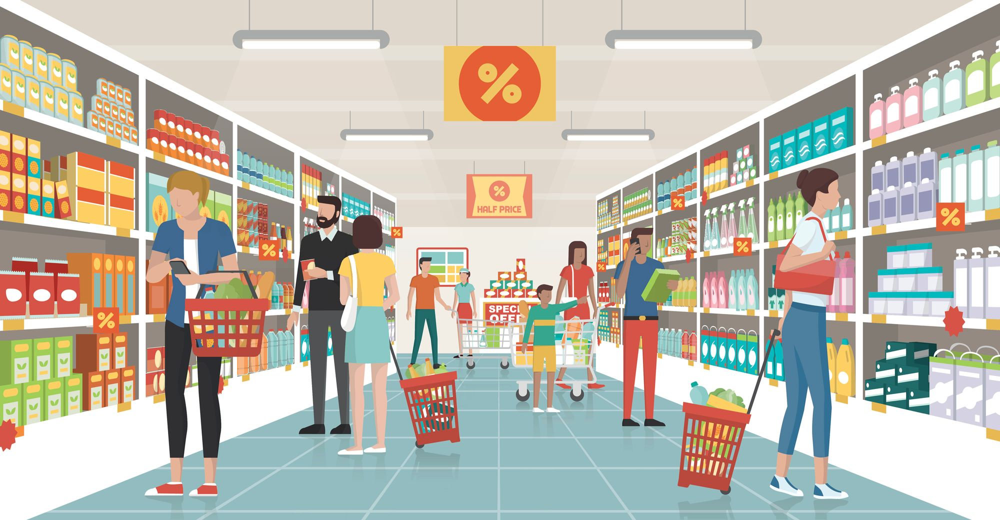
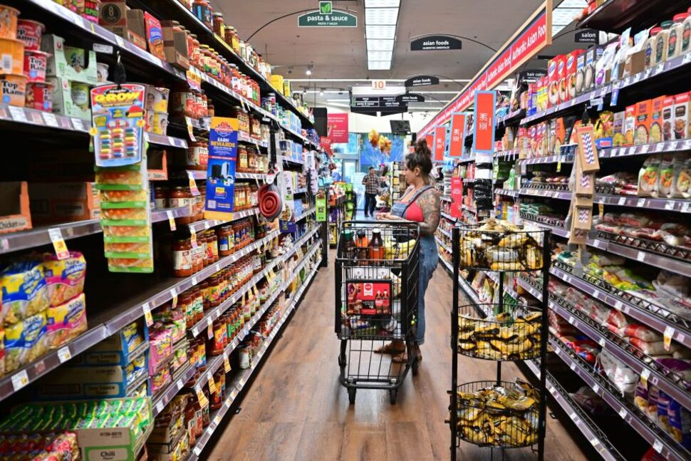
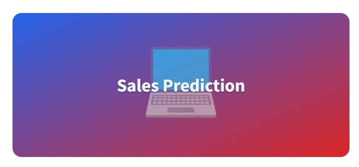

# 🛒 **Streamlit-grocery-sales-prediction-app** 📈



Streamlit-grocery-sales-prediction-app is a web application designed to predict the sales of a grocery shop based on various input features. 🛍️ This application is built using the Streamlit framework, which allows for easy and interactive data analysis and visualization. 💻

The app is designed to take inputs such as:
- Store number 🏪
- Products 🍞🥦
- On promotion 💰
- State 🌍
- Store type 🏬
- Cluster 📊
- Date 📅
- And other variables

By providing these inputs, the app provides a predicted sales value, helping grocery store owners predict their sales for a given period. 📊 This prediction can assist in making better business decisions based on the anticipated values.

The Streamlit-grocery-sales-prediction-app is a valuable tool for grocery store owners, enabling them to forecast their sales and optimize their strategies accordingly. 📈📉


## Summary
| Code      | Name        | Published Article |  Deployed App |
|-----------|-------------|:-------------:|------:|
| LP4 | Grocery Sales Prediction App with Streamlit|  [Grocery prediction article](https://medium.com/@alidu143/building-a-sales-prediction-app-with-streamlit-and-machine-learning-31746625d6ca) | [Grocery prediction App](https://huggingface.co/spaces/Abubakari/Sales_Prediction#sales-prediction-app) |


# Project description 🛒📈

The **Streamlit Grocery Sales Prediction App** is a web application that allows users to predict the sales of a grocery shop based on input data such as store number, product type, promotions, oil prices, and more. 📊💰



### Features and Functionality
- Users can input their data through a user-friendly interface. 🖥️💻

- The app uses a machine learning model trained on a dataset of grocery sales data to make predictions. 🧠🔍

- It incorporates various machine learning techniques for data preprocessing, imputation, encoding, scaling, and classification to ensure accurate predictions. ⚙️🔢

- The predicted sales value is displayed as the output, allowing grocery store owners and managers to make informed decisions about their sales strategy. 📈📉

### Technology Stack
- The app is built using the Streamlit library, which makes it easy to create interactive web applications with Python. 🐍🌐

- It leverages machine learning algorithms and techniques to perform accurate sales predictions. 🤖🔬

- The frontend is designed with user-friendly interfaces to ensure a seamless user experience. 👩‍💻👨‍💻

## Setup

## Installation

### Manual Setup

For manual installation, you need to have `Python 3` on your system. Then you can clone this repo and be at the repo's root `https://github.com/aliduabubakari/Streamlit-grocery-sales-prediction-app` to follow the steps as outlined below; 

## Setting up the Environment

To run the evaluation locally, follow these steps:

1. Create a Python virtual environment to isolate the project's required libraries and avoid conflicts. Execute the following command in your terminal:

    ```bash
    python -m venv venv
    ```
   
2. Activate the Python virtual environment to use the isolated Python kernel and libraries. Run the appropriate command based on your operating system:

    - For Windows:
    ```bash
    venv\Scripts\activate
    ```
    - For Linux and MacOS:
    ```bash
    source venv/bin/activate
    ```

3. Upgrade Pip, the package manager, to ensure you have the latest version. Use the following command:

    ```bash
    python -m pip install --upgrade pip
    ```

4. Install the required libraries listed in the `requirements.txt` file. Run the command:

    ```bash
    python -m pip install -r requirements.txt
    ```

*Note: If you encounter any issues on MacOS, please make sure Xcode is installed.*

By following these steps, you will set up the necessary environment and install all the required packages to run the evaluation on your local machine.

## Running the Execution 

To run the demo app (being at the repository root), use the following command:

```bash
streamlit run lp4.py
```

## Deployed App on Huggingface: 

Alternatively, you can visit:

[](https://huggingface.co/spaces/Abubakari/Sales_Prediction#sales-prediction-app)


### App Execution on Huggingface
Here's a step-by-step process on how to use the Streamlit Grocery Sales Prediction App:

Step 1: 🌐 Open the web app in your browser.

Step 2:📝 You will see input fields on the page with several input requests.

Step 3:🖋️ Enter the values for the input fields that you would like to use for the prediction. For example, select the store number, the product category, and the date of the prediction.

Step 4:🚀 After filling all the input fields, click the "Predict Sales" button.

Step 5:📊 The app will then display the predicted sales value based on the inputs you provided.

That's it! You can repeat steps 3-5 with different input values to see how the predicted sales value changes based on different factors.


The Streamlit Grocery Sales Prediction App is a valuable tool for grocery store owners and managers, enabling them to predict and optimize their sales strategies for better business outcomes. 💪📊


## Author

`Alidu Abubakari`

`Data Analyst`

`Azubi Africa`

- [](https://www.linkedin.com/in/alidu-abubakari-2612bb57/) 


